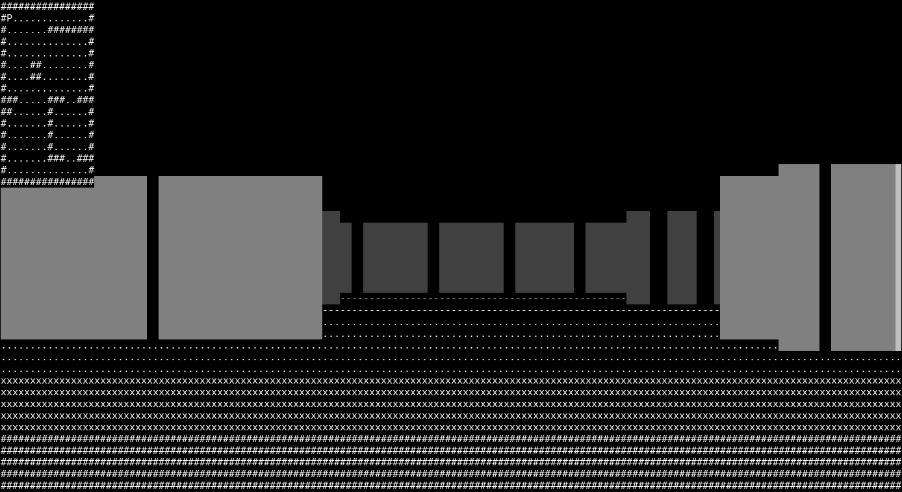

# First Person

A simple game which renders a 3D projection in the terminal. It doesn't
look great for all console fonts (looking at you default macOS terminal) and
font sizes.

I have tested this using a monospaced font (i.e. monospace regular) with a font
size of 12 pixels.



## Controls

The player can be moved using the arrow keys or WASD. There is no strafing in
the game, so LEFT and RIGHT (A and D) changes the direction of the perspective. 

## Building and Requirements

This project uses NCurses 5 to write to the terminal window and requires your
terminal to support Unicode characters. As such, this program requires you to 
have NCurses 5 installed as well as the libraries which allow NCurses to write
Unicode characters to the terminal. On Debian based systems, i.e Ubuntu, these
libraries can be installed as such,

```bash
$ sudo apt install lib-ncurses5-dev libncursesw5-dev
```

On macOS, NCurses 5 can be installed using Homebrew (and probably MacPorts),

```bash
$ brew install ncurses
```

Using CMake, the program can be built, for example, as such,

```bash
$ mkdir -p build && cd build
$ cmake ..
$ make
``` 

## Acknowledgments 

This project was inspired by javidx9's 
[YouTube video](https://www.youtube.com/watch?v=xW8skO7MFYw) and the ray casting
algorithm which he implemented. Here, I have, attempted to at least, implement a
version of this algorithm in C instead of C++.
